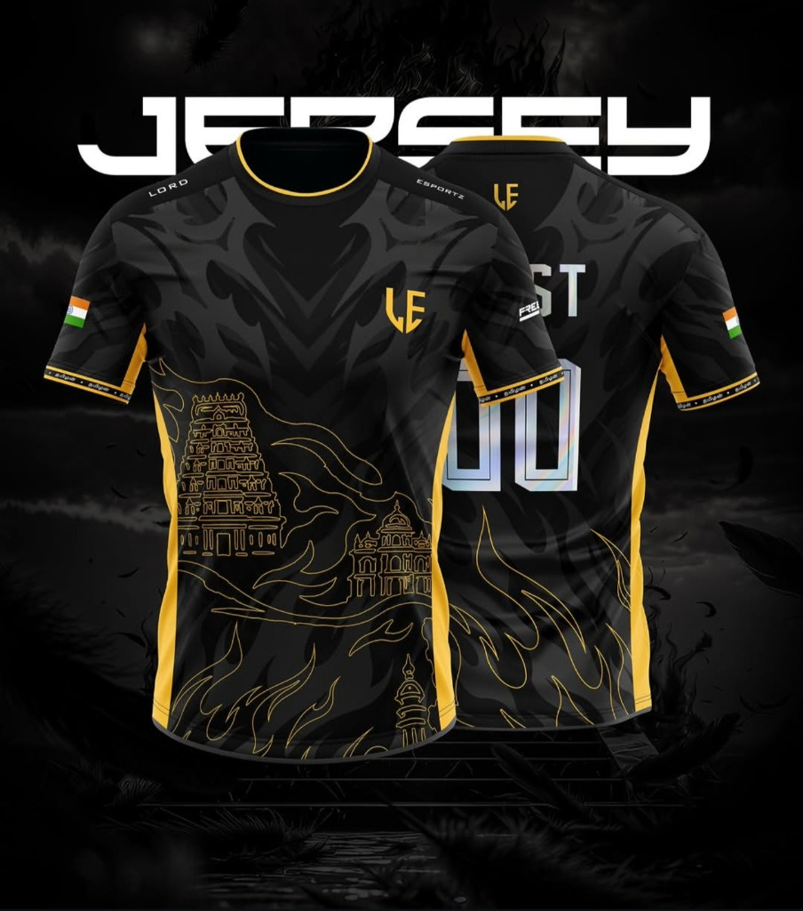

# 🏆 LORDZ ESPORTS — Official Platform Frontend

A premium, modern, and cinematic frontend website built for **LORDZ ESPORTS** — an Indian competitive esports organization and gaming platform.



---

## ⚡ Overview

Lordz Esports is designed around high-stakes gaming culture, Indian cultural heritage, and sports broadcast UI:
- **Color Identity**: Deep Black (`#050505`), Dark Charcoal (`#111111`), and Official Lordz Gold (`#FFBE32`).
- **Typography**: Unified modern geometric typography using **Poppins** across all headings, display titles, and body copy.
- **Cultural Identity**: Subtle Dravidian South Indian temple gopuram line art and flame motifs drawn directly from the official team jersey.

---

## 🛠️ Technology Stack

- **Framework**: [React 19](https://react.dev/) + [TypeScript](https://www.typescriptlang.org/)
- **Bundler**: [Vite 6](https://vitejs.dev/)
- **Styling**: [Tailwind CSS v4](https://tailwindcss.com/)
- **Motion & Animations**: [Framer Motion](https://www.framer.com/motion/)
- **Icons**: [Lucide React](https://lucide.dev/)
- **Micro-Interactions**: [canvas-confetti](https://www.npmjs.com/package/canvas-confetti)

---

## 🌟 Key Features & Sections

1. **Cinematic Hero**:
   - Dynamic entrance animation on page load.
   - Mouse-follow parallax effect on desktop.
   - 3D floating card featuring the official **Lordz Pro Jersey**.
2. **Live Esports Status Bar**:
   - Real-time broadcast ticker with animated `LIVE NOW` indicator.
3. **"Enter the Arena" Tournament Engine**:
   - Interactive client-side filters for **Game** (*Free Fire, Free Fire Max*) and **Status** (*Live, Upcoming, Completed*).
   - Modal registration flow with instant celebration feedback.
4. **Flame of Glory Leaderboard**:
   - Reimagined Black & Gold edition of the official Grand Finals standings.
   - Top 3 podium highlights for **DFG Esports (#1)**, **TB Esports (#2)**, and **Lord Esports (#3)**.
5. **Match Center**:
   - Fixtures with live broadcast triggers, upcoming countdown timer (`02 : 14 : 35`), and match results.
6. **The Battlefield (Teams)**:
   - Organization roster cards with circuit rankings, win rates, and points.
7. **Meet the Players**:
   - Sports trading card layout featuring **BEAST 00** (IGL) using the official jersey back asset.
8. **Wear the Lordz — Jersey Showcase**:
   - Interactive **Front / Back image crossfade switcher**.
   - Customizer modal for player IGN and jersey number print.
9. **Organization Manifesto & Stats**:
   - Scroll-driven *"WE DON'T JUST PLAY / WE COMPETE / WE BUILD LEGACY"*.
   - Animated viewport stats: 25+ Tournaments, 500+ Players, 50+ Teams, ₹5L+ Prize Pool.
10. **Hall of Glory, News, Media & Community**:
    - Timeline of major tournament trophies and MVP awards.
    - Video playback modal for match streams and clips.
    - Community hubs for Discord, WhatsApp, Instagram, and YouTube.
    - Clean sponsor wall and partnership inquiries.

---

## 🚀 Getting Started

### Prerequisites

- Node.js (v18 or higher)
- npm or yarn

### Installation

```bash
# Clone repository
git clone https://github.com/karthikr2602-oss/lordz-esports.git

# Navigate to folder
cd lordz-esports

# Install dependencies
npm install

# Start local development server
npm run dev
```

The application will be accessible at `http://localhost:5173`.

### Production Build

```bash
npm run build
```

---

## 📄 License

© 2026 Lordz Esports. All rights reserved. Made for Indian Esports.
